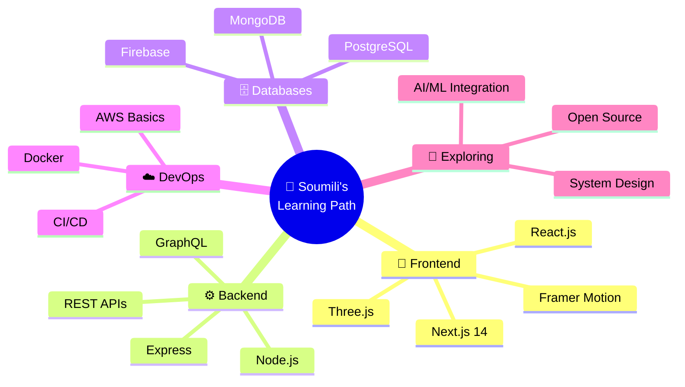

<!-- ═══════════════════════════════════════════════════════════════════════════ -->
<!--                    ✦  SOUMILI BASAK — GITHUB PROFILE  ✦                  -->
<!-- ═══════════════════════════════════════════════════════════════════════════ -->

<!-- ANIMATED GRADIENT HEADER -->


<!-- DYNAMIC TYPING BANNER -->
<div align="center">
  
  <a href="https://git.io/typing-svg">
    
  </a>

  <!-- QUICK STATUS BADGES -->
  <br>
  
  
  
  

</div>

<!-- ANIMATED RAINBOW DIVIDER -->


<!-- ═══════════════════════════════════ ABOUT ═══════════════════════════════════ -->

<h2>
  &nbsp;
  <samp>About Me</samp>
</h2>

<table>
<tr>
<td width="55%" valign="top">

```js
const soumili = {
    pronouns: "she" | "her",
    location: "India 🇮🇳",
    education: "B.Tech Engineering Student",
    
    code: ["JavaScript", "TypeScript", "C", "Java", "Python"],
    
    technologies: {
        frontEnd: {
            js: ["React", "Next.js"],
            css: ["Tailwind CSS", "Bootstrap", "Vanilla CSS"],
        },
        backEnd: {
            js: ["Node.js", "Express"],
        },
        databases: ["MongoDB", "MySQL", "Firebase"],
        devOps: ["Git", "GitHub Actions", "Vercel", "Netlify"],
        tools: ["VS Code", "Figma", "Postman"],
    },
    
    currentFocus: "Building production-grade web apps",
    funFact: "I debug with console.log and I'm not ashamed 😄",
    
    motto: "Code is poetry, and I'm here to write epics.",
};
```

</td>
<td width="45%" valign="top">

<div align="center">
  
  <br><br>
  
  <!-- REAL-TIME CLOCK BADGE -->
  
  <br><br>
  
  <!-- STATUS -->
  
  <br>
  
  <br>
  
  <br>
  
  
</div>

</td>
</tr>
</table>

<!-- ANIMATED DIVIDER -->


<!-- ═══════════════════════════════ TECH STACK ═══════════════════════════════ -->

<h2>
  &nbsp;
  <samp>Tech Stack & Expertise</samp>
</h2>

<div align="center">

<!-- ANIMATED TECH ICONS -->
<table>
<tr>
<td align="center" width="96">
  <a href="#tech-stack">
    
  </a>
  <br><sub><b>JavaScript</b></sub>
</td>
<td align="center" width="96">
  <a href="#tech-stack">
    
  </a>
  <br><sub><b>TypeScript</b></sub>
</td>
<td align="center" width="96">
  <a href="#tech-stack">
    
  </a>
  <br><sub><b>React</b></sub>
</td>
<td align="center" width="96">
  <a href="#tech-stack">
    
  </a>
  <br><sub><b>Python</b></sub>
</td>
<td align="center" width="96">
  <a href="#tech-stack">
    
  </a>
  <br><sub><b>Java</b></sub>
</td>
<td align="center" width="96">
  <a href="#tech-stack">
    
  </a>
  <br><sub><b>GitHub</b></sub>
</td>
</tr>
<tr>
<td align="center" width="96">
  <a href="#tech-stack">
    
  </a>
  <br><sub><b>C / C++</b></sub>
</td>
<td align="center" width="96">
  <a href="#tech-stack">
    
  </a>
  <br><sub><b>MySQL</b></sub>
</td>
<td align="center" width="96">
  <a href="#tech-stack">
    
  </a>
  <br><sub><b>Nginx</b></sub>
</td>
<td align="center" width="96">
  <a href="#tech-stack">
    
  </a>
  <br><sub><b>REST API</b></sub>
</td>
<td align="center" width="96">
  <a href="#tech-stack">
    
  </a>
  <br><sub><b>Prettier</b></sub>
</td>
<td align="center" width="96">
  <a href="#tech-stack">
    
  </a>
  <br><sub><b>ESLint</b></sub>
</td>
</tr>
</table>

<br>

<!-- DETAILED BADGES ROW -->
<details>
<summary><b>🔽 Expand Full Tech Arsenal</b></summary>
<br>

#### 🧑‍💻 Programming Languages
<p>
  
  
  
  
  
  
</p>

#### 🎨 Frontend Technologies
<p>
  
  
  
  
  
  
  
</p>

#### ⚙️ Backend & Databases
<p>
  
  
  
  
  
</p>

#### 🛠️ DevOps & Tools
<p>
  
  
  
  
  
  
  
  
  
</p>

</details>

<br>

<!-- ANIMATED SKILL BARS -->
### 📊 Skill Proficiency

```text
JavaScript   ████████████████████░░░░░   80%
TypeScript   ██████████████████░░░░░░░   72%
React/Next   ████████████████████░░░░░   80%
HTML & CSS   ██████████████████████░░░   88%
Node.js      ███████████████░░░░░░░░░░   60%
C Language   ████████████████░░░░░░░░░   64%
Python       ██████████████░░░░░░░░░░░   56%
Git/GitHub   ██████████████████████░░░   88%
```

</div>

<!-- ANIMATED DIVIDER -->


<!-- ═══════════════════════════════ GITHUB STATS ═══════════════════════════════ -->

<h2>
  &nbsp;
  <samp>GitHub Analytics Dashboard</samp>
</h2>

<!-- ROW 1: Stats + Streak -->
<div align="center">
  
  
</div>

<br>

<!-- ROW 2: Languages + Metrics -->
<div align="center">
  
  &nbsp;&nbsp;
  
</div>

<br>

<!-- ROW 3: Summary Cards -->
<div align="center">
  
  
  
</div>

<br>

<!-- CONTRIBUTION GRAPH -->
<div align="center">
  
</div>

<br>

<!-- 3D CONTRIBUTION CHART -->
<div align="center">
  <picture>
    <source media="(prefers-color-scheme: dark)" srcset="https://raw.githubusercontent.com/Soumi14mili/Soumi14mili/output/github-contribution-grid-snake-dark.svg" />
    <source media="(prefers-color-scheme: light)" srcset="https://raw.githubusercontent.com/Soumi14mili/Soumi14mili/output/github-contribution-grid-snake.svg" />
    
  </picture>
</div>

<!-- ANIMATED DIVIDER -->


<!-- ═══════════════════════════ FEATURED PROJECTS ═══════════════════════════ -->

<h2>
  &nbsp;
  <samp>Featured Projects</samp>
</h2>

<div align="center">

<!-- PROJECT 1 -->
<a href="https://github.com/Soumi14mili/SpendSmart-Student-Expense-Tracker">
  
</a>
&nbsp;
<!-- PROJECT 2 -->
<a href="https://github.com/Soumi14mili/WeatherPulse">
  
</a>

<br><br>

<!-- PROJECT 3 -->
<a href="https://github.com/Soumi14mili/SwapX">
  
</a>
&nbsp;
<!-- PROJECT 4 -->
<a href="https://github.com/Soumi14mili/Soumili-Portfolio-">
  
</a>

</div>

<br>

<!-- LIVE DEMO BUTTONS -->
<div align="center">
  
| 🚀 Project | 📝 Description | 🛠️ Stack | 🔗 Live Demo |
|:---:|:---|:---|:---:|
| **SpendSmart** | Smart expense tracking for students with analytics & budgets | `JavaScript` `React` `Vercel` | [🌐 Visit](https://student-expense-tracker-hfcr.vercel.app/) |
| **WeatherPulse** | Real-time weather dashboard with beautiful UI | `JavaScript` `API` `Vercel` | [🌐 Visit](https://weather-dashboard-nine-theta.vercel.app) |
| **SwapX** | Modern swapping platform with sleek design | `TypeScript` `Next.js` `Vercel` | [🌐 Visit](https://swap-x-4qde.vercel.app/) |
| **Portfolio** | Personal portfolio showcasing all my work | `HTML` `CSS` `JS` `Vercel` | [🌐 Visit](https://soumili-portfolio.vercel.app) |

</div>

<!-- ANIMATED DIVIDER -->


<!-- ═══════════════════════════ TROPHIES ═══════════════════════════ -->

<h2>
  <samp>🏆 GitHub Trophies</samp>
</h2>

<div align="center">
  
</div>

<!-- ANIMATED DIVIDER -->


<!-- ═══════════════════════════ CURRENT FOCUS ═══════════════════════════ -->

<h2>
  &nbsp;
  <samp>What I'm Up To</samp>
</h2>

<div align="center">



</div>

<br>

<div align="center">
<table>
<tr>
<td>

### 🎯 2026 Goals
- [x] Build & deploy 5+ full-stack projects
- [x] Create a stunning portfolio website
- [ ] Contribute to 3+ open source projects
- [ ] Learn Docker & containerization
- [ ] Master System Design fundamentals
- [ ] Build a SaaS product from scratch
- [ ] Reach 100+ GitHub contributions
- [ ] Write technical blog posts

</td>
<td>

### ⚡ Quick Stats
```yaml
🏗️ Projects Shipped: 4+
📦 Repos Created: 5
🔥 Languages Used: 6
☕ Cups of Coffee: ∞
🐛 Bugs Squashed: Countless
💡 Ideas in Pipeline: Many
🎨 Pixels Perfected: Millions
🚀 Deployments: All on Vercel
```

</td>
</tr>
</table>
</div>

<!-- ANIMATED DIVIDER -->


<!-- ═══════════════════════════ METRICS ═══════════════════════════ -->

<h2>
  &nbsp;
  <samp>Advanced Metrics</samp>
</h2>

<div align="center">

<!-- GITHUB METRICS - lowlighter/metrics -->


</div>

<br>

<div align="center">

<!-- CODING ACTIVITY MOCK -->
```text
📅 Last 30 Days Coding Activity (estimated)

💻 JavaScript     12 hrs 45 mins  ████████████░░░░░░░░░   42.3%
🟦 TypeScript      6 hrs 30 mins  ██████░░░░░░░░░░░░░░░   21.6%
🌐 HTML/CSS        5 hrs 15 mins  █████░░░░░░░░░░░░░░░░   17.4%
📊 JSON            2 hrs 10 mins  ██░░░░░░░░░░░░░░░░░░░    7.2%
⚙️ Config files    1 hr  50 mins  █░░░░░░░░░░░░░░░░░░░░    6.1%
📝 Markdown        1 hr  38 mins  █░░░░░░░░░░░░░░░░░░░░    5.4%

⏰ Total: ~30 hrs 8 mins
🔥 Most Productive: Evenings (6PM - 12AM IST)
📁 Most Active Repo: SpendSmart-Student-Expense-Tracker
```

</div>

<!-- ANIMATED DIVIDER -->


<!-- ═══════════════════════════ CONNECT ═══════════════════════════ -->

<h2>
  &nbsp;
  <samp>Connect With Me</samp>
</h2>

<div align="center">
  
  <!-- ANIMATED SOCIAL LINKS -->
  <a href="https://github.com/Soumi14mili" target="_blank">
    
  </a>
  &nbsp;
  <a href="https://soumili-portfolio.vercel.app" target="_blank">
    
  </a>
  &nbsp;
  <a href="https://linkedin.com/in/" target="_blank">
    
  </a>
  &nbsp;
  <a href="https://twitter.com/" target="_blank">
    
  </a>
  &nbsp;
  <a href="mailto:soumilibasak14@gmail.com" target="_blank">
    
  </a>

  <br><br>

  <!-- RANDOM DEV QUOTE -->
  
  
  <br><br>

  <!-- SPOTIFY LISTENING (placeholder - will show when connected) -->
  <a href="https://open.spotify.com/user/">
    
  </a>

</div>

<!-- ANIMATED DIVIDER -->


<!-- ═══════════════════════════ SUPPORT ═══════════════════════════ -->

<div align="center">

### 💖 Support My Work

If you find my projects useful, consider giving them a ⭐!

<a href="https://github.com/Soumi14mili?tab=repositories">
  
</a>
&nbsp;
<a href="https://github.com/Soumi14mili?tab=followers">
  
</a>

<br><br>

<!-- VISITOR COUNTER -->

&nbsp;

&nbsp;


</div>

<br>

<!-- FOOTER WAVE -->


<!-- ═══════════════════════════════════════════════════════════════════════════ -->
<!--                              HIDDEN CREDITS                               -->
<!-- ═══════════════════════════════════════════════════════════════════════════ -->
<!-- 
  ╔══════════════════════════════════════════════════════════════╗
  ║  🎨 Crafted with love by Soumili Basak                     ║
  ║  🛠️ Tools: capsule-render, readme-typing-svg,              ║ 
  ║     github-readme-stats, github-profile-trophy,            ║
  ║     github-readme-streak-stats, github-readme-activity     ║
  ║     -graph, github-profile-summary-cards, techstack-        ║
  ║     generator, mermaid diagrams                            ║
  ║  📅 Last updated: August 2026                              ║
  ╚══════════════════════════════════════════════════════════════╝
-->
